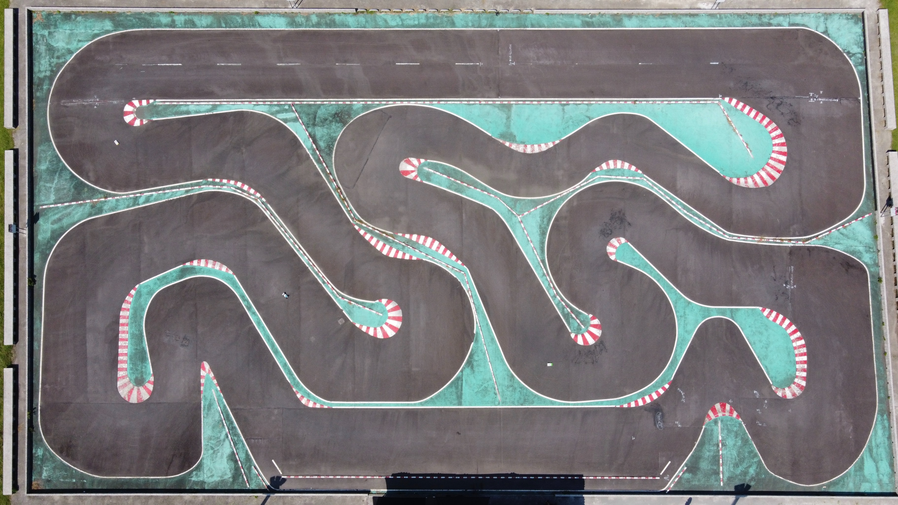

# FeatureExtraction_LaneBoundary_ExtractCL

<p align="center">
  <h2 align="center"> FeatureExtraction_LaneBoundary_ExtractCL </h2>
  <pre align="center">
    
  </pre>
  <p align="center">
    This repository contains a set of MATLAB functions for extracting lane-marker-based road centerlines using LiDAR data.
    The extraction process leverages intensity filtering, extrema detection, and pattern matching strategies to identify and
    clean lane marker features. The output is a refined centerline representation for each traversal or "lap".
  </p>
</p>

***

## Table of Contents

- [About the Project](#about-the-project)
- [Getting Started](#getting-started)
  - [Installation](#installation)
- [Structure](#structure)
  - [Top-Level Directories](#top-level-directories)
  - [Dependencies](#dependencies)
- [Functions](#functions)
  - [Basic Support Functions](#basic-support-functions)
  - [Core Functions](#core-functions)
- [Usage](#usage)
  - [General Usage](#general-usage)
  - [Examples](#examples)
- [License](#license)
- [Contact](#contact)

***

## About the Project

This repository provides MATLAB functions for extracting lane-marker-based road center lines from 3D LiDAR point clouds in the ENU coordinate system.

The current implementation focuses specifically on detecting **solid white lane markers**, using LiDAR intensity data combined with extrema filtering and pattern matching techniques. These features are used to identify and clean the lane marker, and then project the result into a continuous center line.

This tool is suitable for use in structured road environments such as test tracks or highways, where lane markings are well-defined.

**Inputs:**

- `pointcloud_array` (Nx10): Point cloud with [X, Y, Z, Intensity, ..., S, T]
- `s_width`: Width of each s-bin (e.g., 0.5)
- `s_res`, `t_res`: Resolutions for ST grid
- `min_pts`: Minimum number of points per bin
- `Ref_Pose`: Vehicle pose reference [X, Y, Z, ..., Yaw, Station]

**Outputs:**

- `XYZSTE_Center_Line_Array`: Extracted centerline in ENU [X, Y, Z, S, T, MSE]
- `HistoryData`: Struct with patterns, filters, and centerline metadata

***

## Getting Started

### Installation

1. Use MATLAB 2023b or later
2. Clone this repo:

```bash
git clone https://github.com/ivsg-psu/FeatureExtraction_LaneBoundary_ExtractCL
```

3. Run the setup script:

```matlab
script_demo_ExtractCL
```

This installs required utilities and sets up the MATLAB path. To force reinstallation, delete the `/Utilities` folder and clear all globals.

4. Run:

```matlab
script_demo_Laps
```

***

## Structure

### Top-Level Directories

- `/Documents`: Usage descriptions
- `/Functions`: Core and helper MATLAB functions
- `/Utilities`: External dependencies (e.g. PathClassLibrary)

### Dependencies

- [DebugTools](https://github.com/ivsg-psu/Errata_Tutorials_DebugTools)
- [PathClassLibrary](https://github.com/ivsg-psu/PathPlanning_PathTools_PathClassLibrary)
- [PlotRoad](https://github.com/ivsg-psu/FieldDataCollection_VisualizingFieldData_PlotRoad)

Install these in `./Utilities/`.

...


***

## Functions

### Basic Support Functions

#### fcn_ExtractCL_plotCenterLineXY

Plots the centerline in ENU coordinates. Helpful for visual inspection and debugging.

#### fcn_ExtractCL_plotCenterLineLL

Plots the centerline in LLA coordinates (geoplot). Useful when working with GPS-referenced maps.

---

### Core Functions

#### fcn_ExtractCL_extractCL_WhiteStrip

The `fcn_ExtractCL_extractCL_WhiteStrip` function is the core routine to extract the lane centerline from solid white markers. It projects 3D LiDAR data into the (S, T) frame, applies extrema filtering and pattern matching, and returns a cleaned trajectory in ENU coordinates.

**Inputs:**

- `pointcloud_array`, `s_width`, `s_res`, `t_res`, `min_pts`, `Ref_Pose`, `fig_num`, `HistoryData`

**Outputs:**

- `XYZSTE_Center_Line_Array`, `HistoryData`

---

#### fcn_ExtractCL_matchCLByPattern_WhiteStrip

The `fcn_ExtractCL_matchCLByPattern_WhiteStrip` function performs pattern matching and extrema filtering on a (S, T) intensity grid to find lane centerline candidates.

**Inputs:** ST intensity grid, pattern templates, history, etc.  
**Outputs:** Binary mask, best templates, fit errors

---

#### fcn_LaneDetection_matchPattern

Matches a binary lane pattern to intensity profile via sliding-window search. Returns best-fit index and error.

**Inputs:** 1D intensity vector and pattern  
**Outputs:** matched pattern, index, error

---

#### fcn_ExtractCL_interpolateSTBin

Interpolates irregular (s, t, intensity) points into a grid. Used prior to filtering and pattern matching.

**Inputs:** s_bin, t_bin, intensity, z, resolutions  
**Outputs:** S_interp, T_interp, I_interp, Z_interp

---

#### fcn_ExtractCL_projectPC_STToENU

Projects points from local ST coordinates back into global ENU coordinates using reference pose.

**Inputs:** S, T, ref index, Ref_Pose  
**Output:** XY in ENU

---

#### fcn_ExtractCL_cleanCLPoints

Sorts and filters centerline points using median trend and lateral threshold.

**Inputs:** Centerline array, T threshold  
**Output:** Cleaned centerline array

***

## Usage

### General Usage

All main functions include individual test scripts with the prefix:

```matlab
script_test_fcn_FunctionName
```

You can also use MATLAB’s help command to inspect details:

```matlab
help fcn_FunctionName
```

### Examples

1. Run main setup:

```matlab
script_demo_ExtractCL
```

2. Try individual processing pipelines from `/Functions`.

***

## License

Distributed under the MIT License. See `LICENSE` for details.

***

## Contact

**Sean Brennan** – sbrennan@psu.edu  
Project Link: [https://github.com/ivsg-psu/FeatureExtraction_LaneBoundary_ExtractCL](https://github.com/ivsg-psu/FeatureExtraction_LaneBoundary_ExtractCL)

